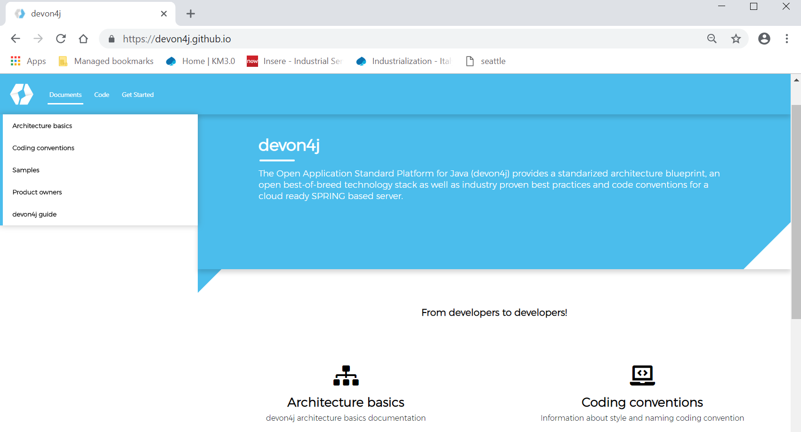

=== What’s Devonfw

Java-based standard platform , an industrialized approach to efficiently deliver projects to  customers. This platform is aimed to engagements where the client is flexible in the use of technology or uses outdated technology,

It can offer a modern technology approach using our experience as a group. The main idea is to not create a monolithic framework but to provide proven patterns.

Devonfw provides a solution to building applications which combine best-in-class frameworks and
libraries as well as industry proven practices and code conventions. It massively speeds up development, reduces risks and helps you to deliver better results.

The current version of the platform is oriented to develop single-page web applications based on the Java EE programming model using the spring framework as the default implementation.

As any modern java application today, Devonfw is based on a large number of technologies and standards that build the software architecture. Devonfw defines how to use these technologies in a layered component-oriented architecture to solve all the technical aspects that make the business code work.

[.text-center]

=== Devonfw Web site URL

The Devonfw site is available here:
[source, URL]
http://www.devonfw.com/

The Devonfw for JAVA (devon4j) can be downloaded from here
[source, URL]
https://devon4j.github.io/

All the documentation about devonfw can be found under https://devonfw.com/website/pages/docs/master.html[docs]. There is a search bar which you can use to quickly find documentation:

=== What’s CobiGen

CobiGen is a high value asset that is used by *devonfw* projects to generate code across all layers of a devon-application, including the clients. It works iteratively without leaving marks or regions in the code due to its basic understanding of Java. Due to architecture patterns set in devonfw, the generator is able to support generation of higher-level concepts than just - class. It is best integrated into the provided eclipse package.

Cobigen can be used to generate the Java backend code as well as the front end Angular code.
[arabic]
. A complete *CRUD* application can be generated from a *single Entity class.*
. Cobigen generates backend classes and client UI (Angular and Ionic) required for CRUD application.
. Agility: Boost development-speed, reduce cost, industrialize.
. Innovation: always evolving, keep the fast pace of technology and incorporate new trends that add value for the engagements.
. Security: Rest assured, devonfw follows best practices to secure your applications.
. DevOps-ready: Supports development and operations with proven solutions for continuous integration, deployment and delivery.

=== HOW TO install Devonfw

In order to install Devonfw please make the following steps:
[arabic]
. Download from https://repository.sonatype.org/service/local/artifact/maven/redirect?r=central-proxy&g=com.devonfw.tools.ide&a=devonfw-ide-scripts&v=LATEST&p=tar.gz[here] and extract the Devonfw distribution in your computer

. Run setup file.

press enter when it prompts Settings URL:
Here is the folder structure after exicuting the setup command;

This will setup the devon IDE.

== Steps to create a Sample Project using Cobigen

The HOW_TO is divided in 2 parts:
[arabic]
. BE-Back End generator (DB + DAO + services) – CONTRACT FIRST APPROACH
. FE-Front End generator (Web App Angular + Ionic App) – CONTRACT FIRST APPROACH

image:images/howtos/e2e_gen/image9.png[cobigen ionic code genartion]

So, ready to go! We’re going to start from the BE part …

=== Back End

run \devonfw-ide-scripts-3.2.4\eclipse-main.bat

It will open eclipse

[arabic, start=6]

create a project using below command from the command prompt

[source, java]
devon java create com.example.domain.myapp

Import the project to eclipse as maven project
image:images/howtos/e2e_gen/image14.png[eclipse devon]

Click *FINISH*

Now We have the following 4 projects.

image:images/howtos/e2e_gen/image15.png[eclipse package explorer]

*BEFORE to start to create an Entity class, remember to create the tables !*

[arabic, start=7]
. Create a new *SQL* *file* (i.e: V0005__CreateTables_ItaPoc.sql) inside __jwtsample-__core and insert the following script:

[source, sql]

CREATE TABLE EMPLOYEE (
id BIGINT auto_increment, modificationCounter *INTEGER* *NOT* *NULL*,
employeeid BIGINT auto_increment,
name VARCHAR(255),
surname VARCHAR(255),
email VARCHAR(255),
PRIMARY KEY (employeeid)
);

*_WARNING_*: please note that there are 2 underscore in the name !

image:images/howtos/e2e_gen/image16.png[sql file]

[arabic, start=8]
. Now create another SQL file (i.e: V0006__PopulateTables-ItaPoc.sql) and add following script about the INSERT in order to populate the table created before

*_WARNING_*: please note that there are 2 underscore in the name !

*INSERT* *INTO* EMPLOYEE (id, modificationCounter, employeeid, name, surname,email) *VALUES* (1, 1, 1, 'Stefano','Rossini','stefano.rossini@capgemini.com');

*INSERT* *INTO* EMPLOYEE (id, modificationCounter, employeeid, name, surname,email) *VALUES* (2, 2, 2, 'Angelo','Muresu', 'angelo.muresu@capgemini.com');

*INSERT* *INTO* EMPLOYEE (id, modificationCounter, employeeid, name, surname,email) *VALUES* (3, 3, 3, 'Jaime','Gonzalez', 'jaime.diaz-gonzalez@capgemini.com');

image:images/howtos/e2e_gen/image17.png[sql insert]
