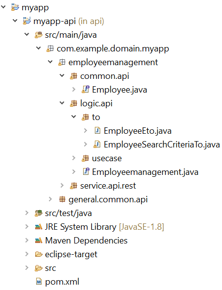
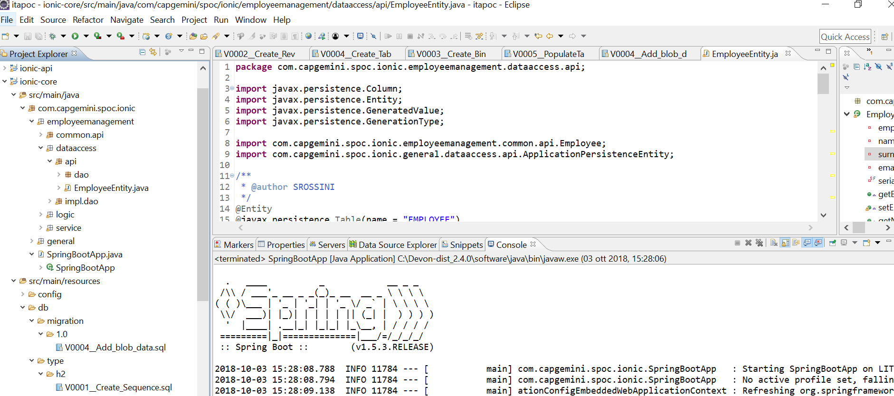
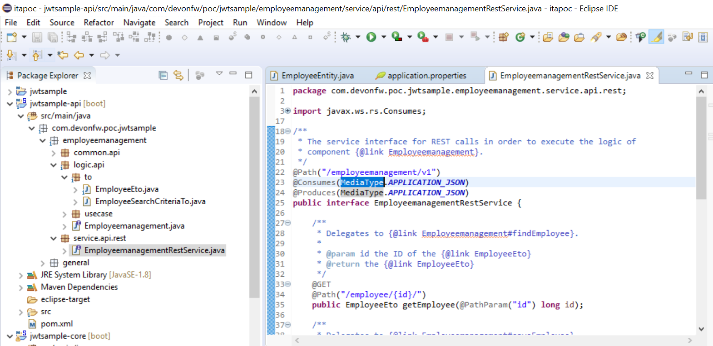
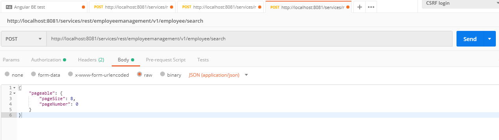
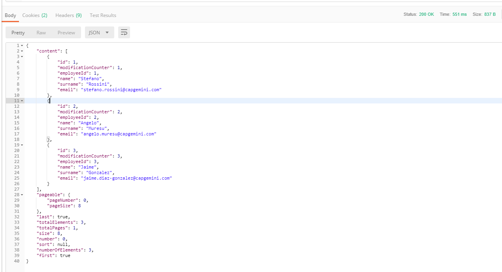
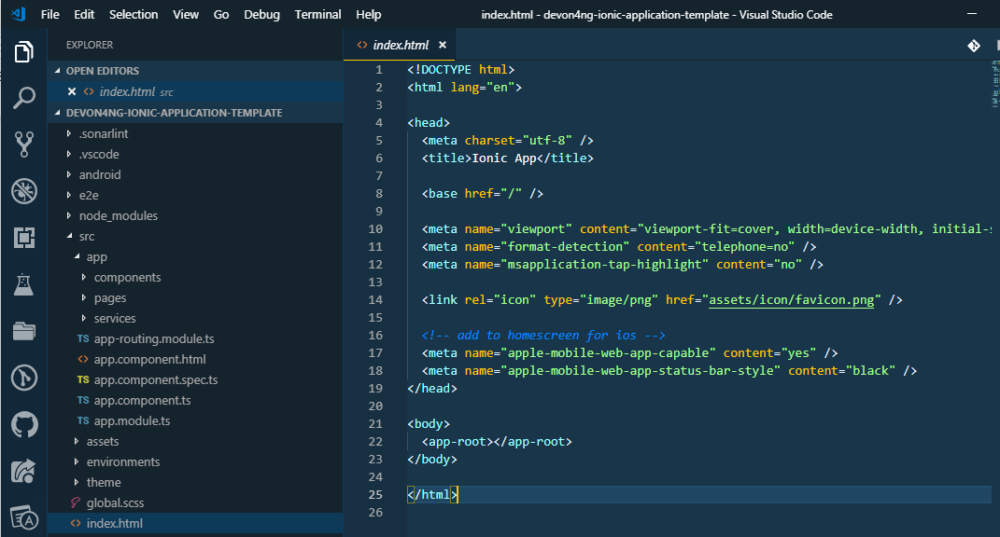
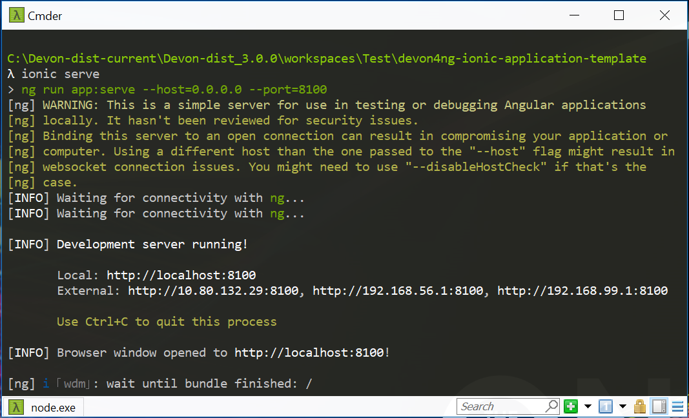

:toc:
toc::[]

include::HOW-TO-devonfw-CobiGen-OpenAPI.adoc[]

*Let's create the Entity Class for the code generation*

[arabic, start=9]
. Create a package “employeemanagement.dataacess.api” under the folder jwtsample-core”. Note: It is important to follow this naming convention for CobiGen to work properly.

image:images/howtos/e2e_gen/poc-entity-package.png[package]

. Now create a JPA Entity class in this package

[source, java]
import javax.persistence.Entity;
import javax.persistence.GeneratedValue;
import javax.persistence.GenerationType;
import javax.persistence.Column;
@Entity
@javax.persistence.Table(name = "EMPLOYEE")
public class EmployeeEntity {
  @Column(name = "EMPLOYEEID")
  @GeneratedValue(strategy = GenerationType.IDENTITY)
  private Long employeeId;
  @Column(name = "NAME")
  private String name;
  @Column(name = "SURNAME")
  private String surname;
  @Column(name = "EMAIL")
  private String email;
}

then generate getters and setters  for all attributes …

[arabic, start=10]
. Use Cobigen to generate code. Right click on EmployeeEntity. CobiGen -> Generate

It will ask you to download the templates, click on _update_:

image:images/howtos/e2e_gen/image19.png[cobigen generate]

It will automatically download the latest version of _CobiGen_Templates_.

*Attention:* If you want to adapt the CobiGen_Templates, (normally this is not neccessary), you will find at the end of this document a tutorial on how to import them and adapt them!

[arabic, start=11]
. Click on all the option selected as below:

image:images/howtos/e2e_gen/image20.png[cobigen option selection]

[arabic, start=12]
. Click on finish. Below Screen would be seen. Click on continue

image:images/howtos/e2e_gen/image21.png[cobigen finish]

*The entire [.underline]#BE layer# structure having CRUD operation methods will be auto generated.*

Some classes will be generated on the api part (_jwtsample-api)_, normally it will be interfaces, as shown below:

Some other classes will be generated on the core part (_jwtsample-core)_, normally it will be implementations as shown below:

image:images/howtos/e2e_gen/image23.png[core folder]

*BEFORE to generate the FE*, please start the Tomcat server to check that BE Layer has been generated properly.

To start a server you just have to right click on “_SpringBootApp.java_” -> _run as -> Spring Boot app_

image:images/howtos/e2e_gen/image24.png[Eclipse run as]

image:images/howtos/e2e_gen/image25.png[Spring boot run]

*BE DONE*

Last but not least: We make a quick REST services test !

See in the application.properties the TCP Port and the PATH

image:images/howtos/e2e_gen/image27.png[application properties]

Now compose the Rest service URL:

service class path>/<service method path>

* <server> refers to server with port no. (ie: localhost:8081)
* <app> is in the application.propeeties (empty in our case, see above)
* <rest service class path> refers to EmployeemanagementRestService: (i.e: /employeemanagement/v1)
* <service method path>/employee/\{id}  (i.e: for  getEmployee method)

URL of getEmployee for this example is:

for all employees
[source, URL]
http://localhost:8081/services/rest/employeemanagement/v1/employee/search

for the specific employee
[source, URL]
http://localhost:8081/services/rest/employeemanagement/v1/employee/1

Now download Postman tool [https://www.getpostman.com/apps]

Once done, you have to create a POST Request for the LOGIN and insert in the body the JSON containing the username and password “waiter”

image:images/howtos/e2e_gen/image29.png[postman]

Once done with success (*Status: 200 OK*) …

image:images/howtos/e2e_gen/image30.png[postman]

… We create a NEW POST Request and We copy the Authorization Bearer field (see above) and We paste it in the Token field (see below)

image:images/howtos/e2e_gen/image31.png[postman]

and specific the JSON parameters for the pagination of the Request that We’re going to send:

image:images/howtos/e2e_gen/image32.png[postman]

Now you can click image:images/howtos/e2e_gen/image34.png[postman]

Now you ‘ve to check that response has got *Status: 200 OK* and to see the below list of Employee

Now that We have successfully tested the BE is time to go to create the FE !

=== Front End

Let’s start now with angular Web and then Ionic app.

==== Angular Web App

[arabic]
.  To generate angular structure, download or clone “*devon4ng-application-template*” from
[source, URL]
https://github.com/devonfw/devon4ng-application-template

image:images/howtos/e2e_gen/image36.png[devon dist folder]

[arabic, start=2]
. Once done, right click on EmployeeEto.java  file present under the package “com.devonfw.poc.employeemanagement.logic.api.to”

[arabic, start=4]
. Click on Finish

image:images/howtos/e2e_gen/image38.png[eclipse]

[arabic, start=5]
. The entire ANGULAR structure has been auto generated. The generated code will be merged to the existing.

image:images/howtos/e2e_gen/image39.png[angular ee layer]

[arabic, start=6]
. IMPORTANT now you have to add in the *_app-routing.module.ts_* file the next content, as a child of HomeComponent, in order to enable the route of the new generated component

,\{

path: 'employee',

component: EmployeeGridComponent,

canActivate: [AuthGuard],

},

Following picture explain where to place the above content:

[arabic, start=7]

. Open the command prompt and execute "devon yarn install" from the base folder, which would download all the required libraries..

[arabic, start=8]
. Check the file *environment.ts* if the server path is correct. (for production you will have to change also the environment.prod.ts file)

image:images/howtos/e2e_gen/image42.png[environment]

In order to do that it’s important to look at the application.properties to see the values as PATH, TCP port etc …

image:images/howtos/e2e_gen/image43.png[configure]

For example in this case the URL should be since the context path is empty the server URLS should be like:

[source, ts]

export const environment = {
production: false,
restPathRoot: 'http://localhost:8081/',
restServiceRoot: 'http://localhost:8081/services/rest/',
security: 'jwt'
};

*Warning*: REMEMBER to set security filed to *jwt* , if it is not configured already.
[arabic, start=9]
. Now run the “*ng serve -o*” command to run the Angular Application.

image:images/howtos/e2e_gen/image44.png[]

[arabic, start=10]
. If the command execution is *successful*, the below screen will *appear* and it would be automatically redirected to the url:
[source, URL]
http://localhost:4200/login

image:images/howtos/e2e_gen/image45.png[]

*WebApp DONE*

==== Ionic Mobile App

[arabic]
.   To generate Ionic structure, download or clone “*devon4ng-application-template*” from
[source, URL]
https://github.com/devonfw/devon4ng-ionic-application-template
. Once done, Right click on the *EmployeeEto* as you already did before in order to use CobiGen.
. Click on the selected options as seen in the screenshot:

image:images/howtos/e2e_gen/image46.png[]

[arabic, start=4]
. Click on Finish
. The entire ionic structure will be auto generated.

[arabic, start=6]
. Change the server url (with correct serve url) in environment.ts, environment.prod.ts and environment.android.ts files (i.e: itapoc\devon4ng-ionic-application-template\src\environments\).

The angular.json file inside the project has already a build configuration for android.

image:images/howtos/e2e_gen/image48.png[]

[arabic, start=7]
. Run npm install in the root folder to download the dependecies
. Run ionic serve

[arabic, start=11]
. {blank}
+

Once the execution is successful

image:images/howtos/e2e_gen/image50.png[]

* Mobile App DONE*

So: well done

Starting from an Entity class you’ve successfully generated the Back-End layer (REST, SOAP, DTO, Spring services, Hibernate DAO), the Angular Web App and the Ionic mobile App!

image:images/howtos/e2e_gen/image51.png[]

include::HOW-TO-devonfw-BuildAPK.adoc[]