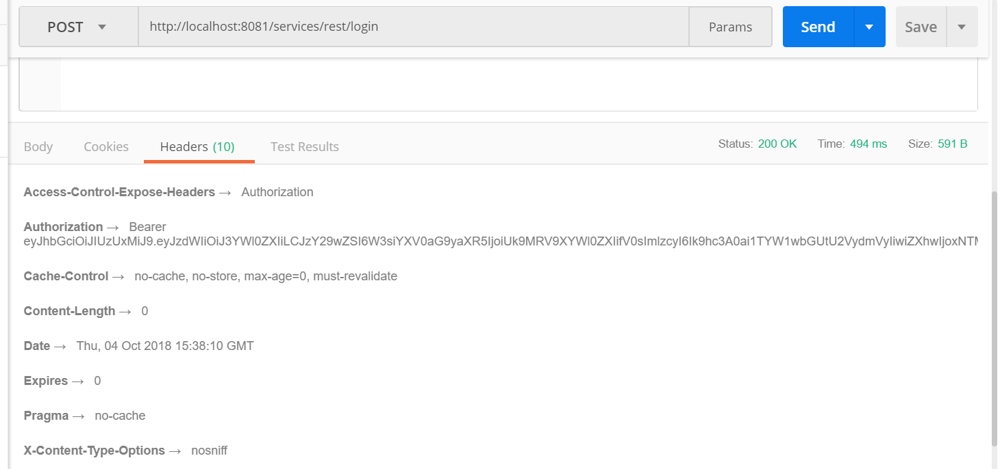
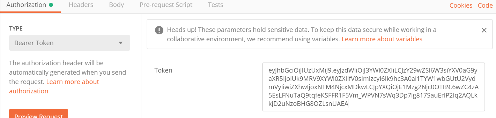
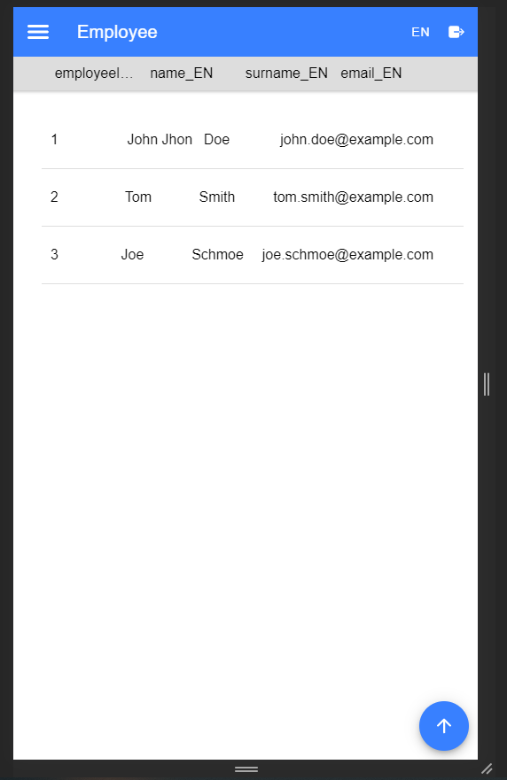

:toc:
toc::[]

:toc:
toc::[]
[.text-center]
= End to End POC Code generation using OpenAPI and Entity class
This article helps to create a sample application using cobigen.

== Prerequisites

Download and install devonnfw IDE https://devonfw.com/website/pages/docs/devonfw-ide-introduction.asciidoc.html#setup.asciidoc[here],

== Steps to create a sample Project using Cobigen

The HOW_TO is divided in 2 parts:
[arabic]
. BE-Back End generator (DB + DAO + services) – CONTRACT FIRST APPROACH
. FE-Front End generator (Web App Angular + Ionic App) – CONTRACT FIRST APPROACH

So, ready to go! We’re going to start from the BE part …

=== Back End

create a project using below command from the command prompt

[source, java]
devon java create com.example.domain.myapp

run
\devonfw-ide-scripts-<version>\eclipse-main.bat
to open eclipse

Import the project to eclipse as maven project
image:images/howtos/e2e_gen/image14.png[eclipse devon]

Click *FINISH*

Now We have the following 4 projects.

image:images/howtos/e2e_gen/image15.png[eclipse package explorer]

Check resources/config/application.properties to see the values as PATH, TCP port etc …
Also make sure the below property is present.

__security.cors.enabled=true__

image:images/howtos/e2e_gen/application_properties.png[configure]

*BEFORE to start to create an Entity class, remember to create the tables !*

* Create new *SQL* *file*  inside myapp-core  resources/db/migration/specific/h2 and insert the following script:

V0005__CreateTables_ItaPoc.sql (*Please note*  2 underscores after V0005)

[source, sql]

CREATE TABLE EMPLOYEE (
id BIGINT auto_increment,
modificationCounter INT NOT NULL,
employeeid BIGINT auto_increment,
name VARCHAR(255),
surname VARCHAR(255),
email VARCHAR(255),
PRIMARY KEY (employeeid)
);

image:images/howtos/e2e_gen/image16.png[sql file]

* Now create another SQL file (i.e: V0006__PopulateTables-ItaPoc.sql ) and add following script about the INSERT in order to populate the table created before

[source, sql]
INSERT INTO EMPLOYEE (id, modificationCounter, employeeid, name, surname,email) VALUES (1, 1, 1, 'Stefano','Rossini','stefano.rossini@capgemini.com');
INSERT INTO EMPLOYEE (id, modificationCounter, employeeid, name, surname,email) VALUES (2, 2, 2, 'Angelo','Muresu', 'angelo.muresu@capgemini.com');
INSERT INTO EMPLOYEE (id, modificationCounter, employeeid, name, surname,email) VALUES (3, 3, 3, 'Jaime','Gonzalez', 'jaime.diaz-gonzalez@capgemini.com');

== Back end Code Generation

Back end code can be generated from either of the below 2 methods
[arabic, start=1]
. OpenAPI .yml file
. java Entity class.

*Prepare OpenAPI  .yml file*

Create a .yml file which satisfies the OpenAPI standards or check the sample file https://github.com/devonfw/tools-cobigen/blob/master/documentation/files/devonfw_employee.yml[devonfw_employee.yml] and prepare.

*Important:* if you want to know how to write an OpenAPI contract compatible with CobiGen, please read https://github.com/devonfw/tools-cobigen/wiki/cobigen-openapiplugin#usage[this tutorial].

Right click _devonfw.yml_. CobiGen -> Generate

It will ask you to download the templates, click on _update_:

*Prepare Entity class*

Create a package *com.example.domain.myapp.employeemanagement.dataaccess.api*

under the folder myapp-core. Note: It is important to follow this naming convention for CobiGen to work properly.

image:images/howtos/e2e_gen/poc-entity-package.png[package]

Now create a JPA Entity class in this package

[source, java]
import javax.persistence.Entity;
import javax.persistence.GeneratedValue;
import javax.persistence.GenerationType;
import javax.persistence.Column;
@Entity
@javax.persistence.Table(name = "EMPLOYEE")
public class EmployeeEntity {
 @Column(name = "EMPLOYEEID")
 @GeneratedValue(strategy = GenerationType.IDENTITY)
 private Long employeeId;
 @Column(name = "NAME")
 private String name;
 @Column(name = "SURNAME")
 private String surname;
 @Column(name = "EMAIL")
 private String email;
}

then generate getters and setters  for all attributes

 Use Cobigen to generate code. Right click on EmployeeEntity. CobiGen -> Generate

It will ask you to download the templates, click on _update_:

=== Code Generation

image:images/howtos/e2e_gen/image19.png[cobigen generate]

It will automatically download the latest version of _CobiGen_Templates_.

*Attention:* If you want to adapt the CobiGen_Templates, (normally this is not neccessary), you will find at the end of this document a tutorial on how to import them and adapt them!

* Click on all the option selected as below:

* Click on finish. Below Screen would be seen. Click on continue

*The entire [.underline]#BE layer# structure having CRUD operation methods will be auto generated.*

Some classes will be generated on the api part (_jwtsample-api)_, normally it will be interfaces, as shown below:

image:images/howtos/e2e_gen/image22.png[be layer]

Some other classes will be generated on the core part (_jwtsample-core)_, those are the implementations as shown below:

image:images/howtos/e2e_gen/image23.png[core folder]

*BEFORE to generate the FE*, please start the Tomcat server to check that BE Layer has been generated properly.

To start a server you just have to right click on _SpringBootApp.java_ -> _run as -> Spring Boot app_

image:images/howtos/e2e_gen/image24.png[Eclipse run as]

image:images/howtos/e2e_gen/image25.png[Spring boot run]

image:images/howtos/e2e_gen/image26.png[Spring boot run]

*BE DONE*

=== Test the Services

Download https://www.getpostman.com/apps[Postman] to test the rest services.

Get the port and path from application.properties

image:images/howtos/e2e_gen/image27.png[application properties]

Now compose the Rest service URL:

service class path>/<service method path>

* <server> refers to server with port no. (ie: localhost:8081)
* <app> is in the application.propeeties (empty in our case, see above)
* <rest service class path> refers to EmployeemanagementRestService: (i.e: /employeemanagement/v1)
* <service method path>/employee/\{id}  (i.e: for  getEmployee method)

image:images/howtos/e2e_gen/image28.png[url mapping]

URL of getEmployee for this example is:

For all employees
[source, URL]
POST
http://localhost:8081/services/rest/employeemanagement/v1/employee/search
Content-Type    application/json
{"name":"Angelo"}

For the specific employee
[source, URL]
GET
http://localhost:8081/services/rest/employeemanagement/v1/employee/1

In postman, create a POST Request for the LOGIN and insert in the body the JSON containing the username and password _admin_

Login Test using postman

[source, URL]
----
    POST
    http://localhost:8081/services/rest/login
    Content-Type    application/json
    {
    "j_username":"admin",
    "j_password":"admin"
     }
----
* Set the header

*Send* will return 200 OK as response.

… We create a NEW POST Request and We copy the Authorization Bearer field (see above) and We paste it in the Token field (see below)

and specific the JSON parameters for the pagination of the Request that We’re going to send:

image:images/howtos/e2e_gen/image32.png[postman]

image:images/howtos/e2e_gen/image33.png[postman]

Now you can click 

Now you ‘ve to check that response has got *Status: 200 OK* and to see the below list of Employee

image:images/howtos/e2e_gen/image35.png[postman]

Now that We have successfully tested the BE is time to go to create the FE !

=== Front End

Let’s start now with angular Web and then Ionic app.

==== Angular Web App

*  To generate angular structure, download or clone _devon4ng-application-template_ from
[source, URL]
https://github.com/devonfw/devon4ng-application-template

Place the files inside workspace under the folder devon4ng-application-template.

eg: C:\projects\devonfw-ide-scripts-2020.08.002\workspaces\main\devon4ng-application-template

In Devon IDE, right click on EmployeeEto.java file present under the package com.example.domain.myapp.employeemanagement.logic.api.to

For OpenAPI, right click on _devonfw.yml_ again.

* CobiGen -> Generate

Click on the selected options as seen in the screenshot:

image:images/howtos/e2e_gen/FEGenOptions.png[eclipse generate]

* Click on Finish

*  The entire ANGULAR structure has been auto generated. The generated code will be merged to the existing.

*  IMPORTANT now you have to add in the *_app-routing.module.ts_* file the next content, as a child of HomeComponent, in order to enable the route of the new generated component

[source]
{
      path: 'employee',
      loadChildren: () =>
          import('./employee/employee.module').then(
              m => m.EmployeeModule,
          )
}

Following picture explain where to place the above content, also remove if any duplicate code is there.

image:images/howtos/e2e_gen/routing-module.png[routes]

* Add newly generated module to the left menu.
Modify the file  app\layout\nav-bar\nav-bar.component.html, add the below code.

[source]
<a id="employee" mat-list-item [routerLink]="['./employee']" (click)="close()">
       <mat-icon matListAvatar>
        grid_on
       </mat-icon> <h3 matLine> {{ 'employeemanagement.Employee.navData' | transloco }} </h3>
       
 {{ 'employeemanagement.Employee.navDataSub' | transloco }} 

</a>

image:images/howtos/e2e_gen/nav-bar.png[nav bar]

* Check the file *environment.ts* if the server path is correct. (for production you will have to change also the environment.prod.ts file)

image:images/howtos/e2e_gen/image42.png[environment]

For example in this case the URL should be since the context path is empty the server URLS should be like:

[source]
export const environment = {
production: false,
restPathRoot: 'http://localhost:8081/',
restServiceRoot: 'http://localhost:8081/services/rest/',
security: 'jwt'
};

*Warning*: REMEMBER to set security filed to *jwt* , if it is not configured already.

*  Open the command prompt and execute below command from the base folder, which would download all the required libraries..

[source]
devon yarn install

Run the below command for the front end.

[source]
devon ng serve

image:images/howtos/e2e_gen/image44.png[]

* If the command execution is *successful*, the below screen will *appear* and it would be automatically redirected to the url:
[source, URL]
http://localhost:4200/login

image:images/howtos/e2e_gen/image45.png[]

*WebApp Done*

==== Ionic Mobile App

*   To generate Ionic structure, download or clone _*devon4ng-application-template*_ from
[source, URL]
https://github.com/devonfw/devon4ng-ionic-application-template

right click on EmployeeEto.java file present under the package com.devonfw.poc.employeemanagement.logic.api.to

For OpenAPI, Right click on the *_devonfw.yml_* as you already did before in order to use CobiGen.

* Click on the selected options as seen in the screenshot:

* Click on Finish
* The entire ionic structure will be auto generated.

image:images/howtos/e2e_gen/image47.png[]

* Change the server url (with correct serve url) in environment.ts, environment.prod.ts and environment.android.ts files (i.e: itapoc\devon4ng-ionic-application-template\src\environments\).

The angular.json file inside the project has already a build configuration for android.

image:images/howtos/e2e_gen/image48.png[]

* Run npm install in the root folder to download the dependecies
* Run ionic serve

image:images/howtos/e2e_gen/image49.png[]

. {blank}
+

Once the execution is successful

* Mobile App Done*

So: well done

Starting from an Entity class you’ve successfully generated the Back-End layer (REST, SOAP, DTO, Spring services, Hibernate DAO), the Angular Web App and the Ionic mobile App!

image:images/howtos/e2e_gen/image51.png[]

===== Build APK

Since We’re going to create apk remember the following pre-conditions:

* https://gradle.org/install/[Gradle]
* https://developer.android.com/studio[Android Studio]
* https://developer.android.com/studio/#command-tools[Android sdk]
* https://capacitor.ionicframework.com/docs/getting-started/[Capacitor]

[arabic]
. Now, open cmd and type the path where your _devon4ng-ionic-application-template_ project is present.
. Run the following commands:
[loweralpha]
.. npx cap init
.. ionic build --configuration=android
.. npx cap add android
.. npx cap copy
.. npx cap open android
. Build the APK using Android studio.

image:images/howtos/e2e_gen/image52.png[]
image:images/howtos/e2e_gen/image53.png[]
image:images/howtos/e2e_gen/image54.png[]

You can find your apk file in

/devon4ng-ionic-application-template/android/app/build/outputs/apk/debug

== Adapt CobiGen_Templates

After following this tutorial, you will have the CobiGen_Templates downloaded on your local machine. To import these templates you need to do the following:

Right click in any part of the package explorer, then click on CobiGen -> Adapt templates

image:images/howtos/e2e_gen/image56.png[]

Click _Ok_:

image:images/howtos/e2e_gen/image57.png[]

Now the CobiGen_Templates project will be automatically imported into your workspace, as shown on the image below:

image:images/howtos/e2e_gen/image58.png[]

Now you just need to change the Java version of the project to JRE 1.8. Right click on the JRE system library, and then on _Properties:_

image:images/howtos/e2e_gen/image60.png[]

Now change the version to Java 11

Now you have successfully imported the CobiGen templates. If you want to edit them, you will find them in the folder _src/main/templates._ For instance, the Java templates are located here:

image:images/howtos/e2e_gen/image62.png[]

Now you can adapt the templates as much as you want. Documentation about this can be found on:

[source, URL]
https://github.com/devonfw/tools-cobigen/wiki/Guide-to-the-Reader
